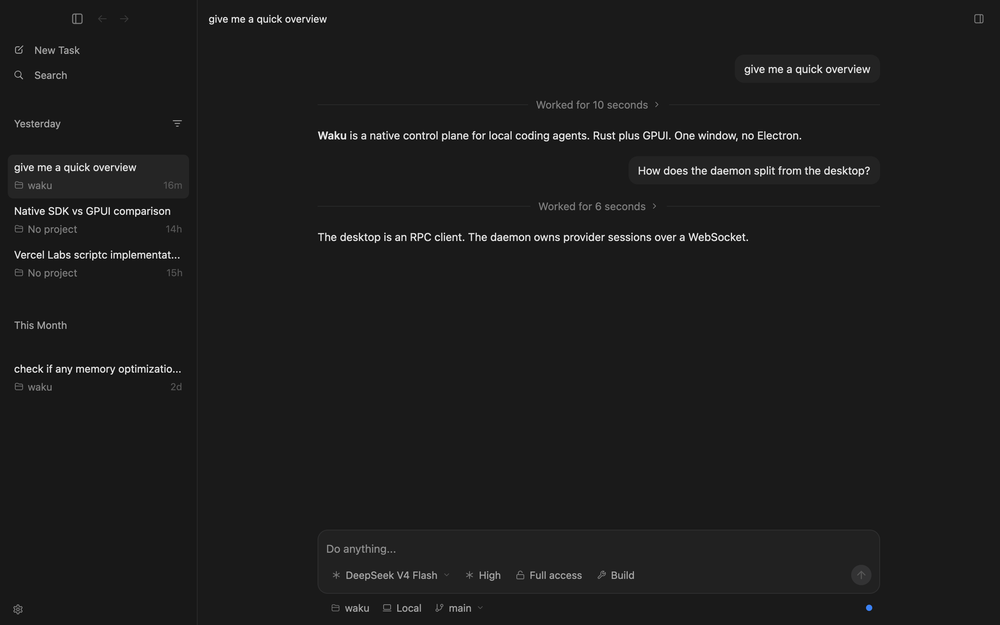
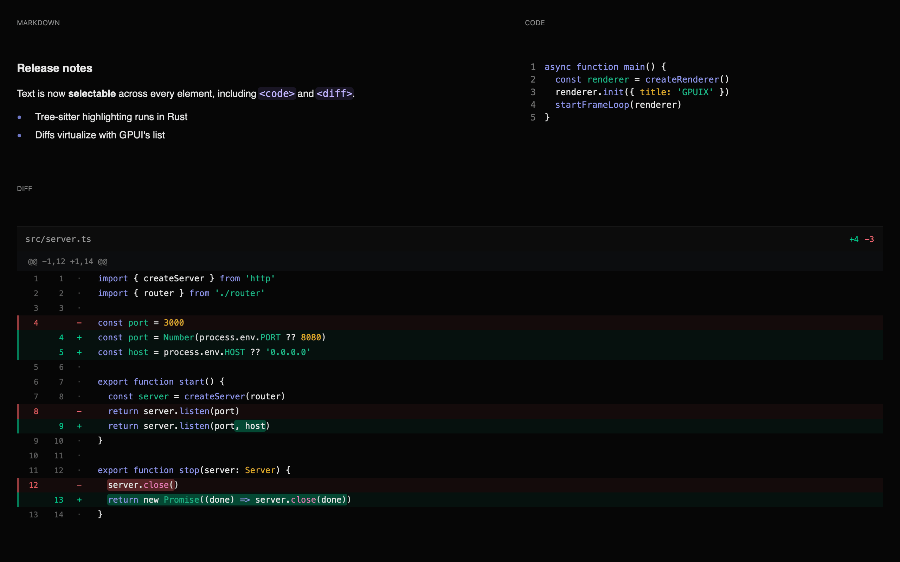
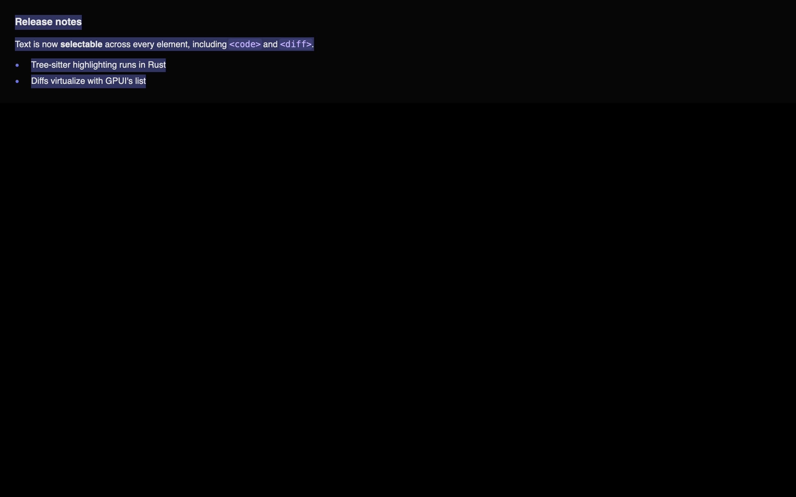
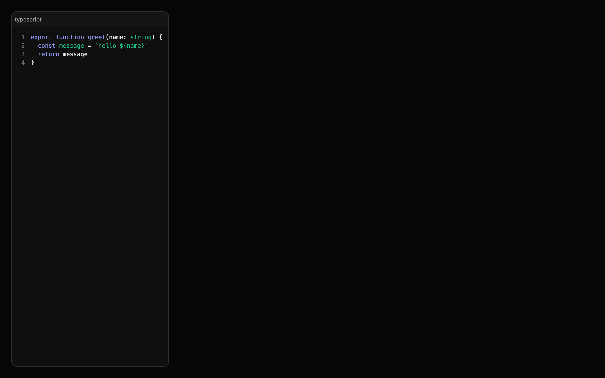
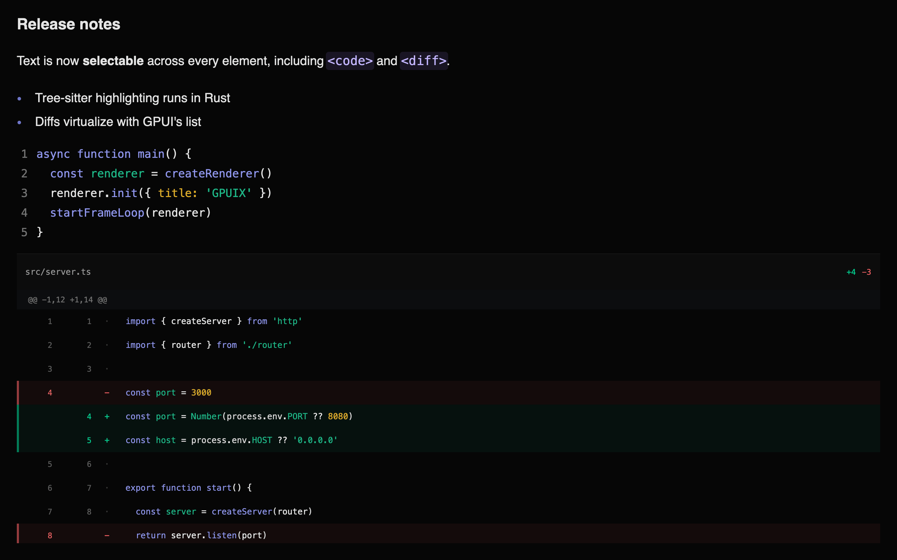

# GPUIV

Vue 3 bindings for [GPUI](https://github.com/zed-industries/zed/tree/main/crates/gpui) - Zed's GPU-accelerated UI framework.

Build native GPU-accelerated desktop apps with Vue 3 and TypeScript. Your components render directly to the GPU via Metal, DirectX, or Vulkan. No Electron, no web views.

## Relationship to upstream GPUIX

GPUIV is a personal fork of [remorses/gpuix](https://github.com/remorses/gpuix), created for experimentation and learning. The upstream GPUIX project provides Node.js and **React** bindings for GPUI; this fork replaces the React-facing package with a **Vue 3** custom renderer and publishes the result as `@gpuiv/vue` plus the native package `@gpuiv/native`.

Most of the underlying architecture — including the Rust/napi-rs native layer, retained tree, mutation protocol, GPUI integration, native elements, and testing approach — comes from upstream GPUIX. Unless a change is specifically noted in this repository's history, implementation details and ongoing maintenance should first be checked against [upstream GPUIX](https://github.com/remorses/gpuix). This fork may diverge as the Vue binding evolves.



Everything above is GPUIV: the sidebar, the scrolling list, the composer,
and native `<markdown>`. Start it with **`bun --hot`** so a save remounts Vue
on the same window:

```bash
cd examples && bun --hot chat.tsx
```

## Examples

| Example | Run | What it shows |
|---|---|---|
| **chat** | `bun --hot chat.tsx` | A Waku-style app: transparent titlebar, animated sidebar, message list, composer, `<markdown>` |
| **blurred window** | `bun --hot blurred-window.tsx` | A macOS frosted-glass surface using GPUI's native vibrancy backdrop and transparent titlebar |
| **native-text** | `bun --hot native-text.tsx` | The three native text components with a tab switcher |
| **counter** | `bun --hot counter.tsx` | The smallest possible app: state, events, hover |
| **diff** | `bun --hot diff.tsx` | A diff viewer composed from `<div>` and `<text>` in JS, for comparison |

All of them live in [`examples/`](./examples) and use hardcoded data.

Markdown, code and a virtualized diff in one frame:



## Architecture

GPUIV bridges Vue to GPUI using a **mutation-based protocol** over napi-rs FFI. Vue's custom renderer (`createRenderer` from `vue`) queues DOM-like mutations (`createElement`, `appendChild`, `setStyle`, …) and applies them to Rust as **one atomic `applyBatch(json)` per flush** — no JSON tree serialization. Rust maintains a retained element tree that GPUI reads each frame.

```
┌─────────────────────────────────────────────────────────────────┐
│  Vue 3 (JavaScript)                                             │
│                                                                 │
│  import { defineComponent, ref } from 'vue'                     │
│                                                                 │
│  const Counter = defineComponent({                              │
│    setup() {                                                    │
│      const count = ref(0)                                       │
│      return () => (                                             │
│        <div style={{ display: 'flex', gap: 8 }}>                │
│          <div onClick={() => count.value++}>+</div>             │
│        </div>                                                   │
│      )                                                          │
│    },                                                           │
│  })                                                             │
└─────────────────────────────────────────────────────────────────┘
                    │ one atomic batch per flush
                    │ applyBatch([
                    │   ["createElement", 1, "div"],
                    │   ["appendChild", 0, 1],
                    │   ["setStyle", 1, {...}],
                    │ ])
                    ▼
┌─────────────────────────────────────────────────────────────────┐
│  Rust (napi-rs)                                                 │
│                                                                 │
│  RetainedTree ── stores elements, styles, event flags           │
│       │                                                         │
│       ▼  each GPUI frame                                        │
│  GpuixView::render() → build_element() → GPUI elements         │
└─────────────────────────────────────────────────────────────────┘
                    │
                    ▼
┌─────────────────────────────────────────────────────────────────┐
│  GPUI                                                           │
│                                                                 │
│  GPU rendering via Metal (macOS), DirectX (Windows), or Vulkan  │
│  Flexbox layout via Taffy                                       │
└─────────────────────────────────────────────────────────────────┘
```

## Why This Works

GPUI is an **immediate-mode** UI framework — it rebuilds the entire element tree every frame. Instead of fighting this, GPUIV embraces it:

1. Vue's custom renderer detects a state change and queues napi mutations (`createElement`, `setStyle`, `appendChild`, …)
2. Each queued batch updates a **RetainedTree** on the Rust side — a map of element nodes with interned styles, children, and event flags
3. On each GPUI frame, `GpuixView::render()` walks the RetainedTree and calls `build_element()` to produce ephemeral GPUI elements
4. GPUI lays them out (Taffy flexbox) and renders to the GPU
5. Only **changed elements** cross the FFI boundary — Vue's patch diffs the vnode tree and sends minimal mutations

This is the same protocol other custom renderers use for the DOM (`createElement`, `appendChild`, `insertBefore`, props), but targeting a GPU renderer instead of a browser.

## Mutation API

The FFI surface between JS and Rust is one atomic batch call — the `NativeRenderer` interface has a single required mutation method (everything else is optional query/command API):

```ts
interface NativeRenderer {
  /** Apply one commit. Returns every element id destroyed by the batch. */
  applyBatch(json: string): Array<number>
  // …optional focus/scroll/selection/window/debug methods
}
```

The wire format is nine ops: `["createElement", id, type]`, `["destroyElement", id]`, `["appendChild", parentId, childId]`, `["insertBefore", parentId, childId, beforeId]`, `["setStyle", id, style]` (raw object), `["setText", id, content]`, `["setEventListener", id, type, hasHandler]`, `["setRoot", id]`, `["setCustomProp", id, key, value]` (raw JSON value). There is no `removeChild` op — `destroyElement` unlinks from the parent in Rust, and `appendChild`/`insertBefore` re-parent.

Element IDs are plain numbers generated by an incrementing counter in JS. Vue's renderer patches synchronously within a component update, but the update itself is scheduled on a microtask, so host ops are queued by the batching facade (`MutationRenderer`) and flushed with one `applyBatch()` on a microtask after Vue's scheduler has finished its jobs. `flushMutations()` drains that queue synchronously for callers that need the Rust tree current right away (mount, tests, clock-pinned frames). Applying a batch marks the Rust view dirty for the next frame.

## Event Flow

Events travel from GPUI back to Vue through a `ThreadsafeFunction` callback:

```
User clicks element id=3
       │
       ▼
GPUI fires on_click on the element
       │
       ▼
Rust closure calls emit_event_full(callback, 3, "click", {x, y, ...})
       │
       ▼
ThreadsafeFunction queues EventPayload on Node.js event loop
       │
       ▼
JS event registry: eventHandlers.get(3)?.get("click")?.(payload)
       │
       ▼
Vue handler runs: onClick={() => count.value++}
       │
       ▼
State update triggers re-render → patch sends mutations back to Rust
```

Event handlers are stored in a JS-side registry keyed by `(elementId, eventType)`. Rust only knows **whether** an element has a listener (via `setEventListener`), not the closure itself — the actual handler lives in JS.

## Packages

- **`@gpuiv/native`** — Rust/napi-rs bindings to GPUI. Contains `GpuixRenderer`, `RetainedTree`, `build_element()`, `apply_styles()`, and the event wiring.
- **`@gpuiv/vue`** — Vue 3 custom renderer (`createRenderer` from `vue`), event registry, components, and TypeScript types. Implements the mutation API as the host config.

## Building

### Prerequisites

1. Rust toolchain
2. Node.js 18+
3. Xcode with Metal Toolchain (macOS)

```bash
# Install Metal Toolchain if needed
xcodebuild -downloadComponent MetalToolchain

# Install dependencies
bun install

# Check out the pinned GPUI fork
git submodule update --init --recursive

# Build everything (native + vue)
bun run build

# Or build each package separately
cd packages/native
bun run build

cd ../vue
bun run build

# Run an example (use tmux for long-running sessions)
cd ../../examples
bun --hot counter.tsx
```

## Usage

```tsx
import { defineComponent, ref } from 'vue'
import { createApp } from '@gpuiv/vue'

const App = defineComponent({
  setup() {
    const count = ref(0)
    return () => (
      <div style={{ display: 'flex', gap: 8, padding: 16 }}>
        <div
          style={{ backgroundColor: '#3b82f6', borderRadius: 8, padding: 12, cursor: 'pointer' }}
          onClick={() => count.value++}
        >
          <div style={{ color: '#ffffff' }}>Count: {count.value}</div>
        </div>
      </div>
    )
  },
})

createApp(App, {
  title: 'My App',
  width: 800,
  height: 600,
  titlebarTransparent: true,
  windowBackground: 'blurred',
  trafficLightX: 16,
  trafficLightY: 17,
})
```

`createApp()` creates the native window, mounts the Vue app, and starts the frame loop.
The red traffic-light button quits the process. Start the app again from the
terminal.

| Option | Values | Purpose |
|---|---|---|
| `title` | string | Window title |
| `width` / `height` | pixels | Initial window size (default 800×600) |
| `minWidth` / `minHeight` | pixels | Minimum window size |
| `resizable` | boolean (default `true`) | Allow the window to be resized |
| `fullscreen` | boolean | Start fullscreen |
| `transparent` | boolean | Plain alpha transparency. Prefer `windowBackground` when you need blur |
| `titlebarTransparent` | boolean | Hide the native titlebar so the app draws chrome under the traffic lights |
| `windowBackground` | `"opaque"` (default), `"transparent"`, `"blurred"` | Window fill. `"blurred"` is the macOS vibrancy backdrop |
| `trafficLightX` / `trafficLightY` | pixels | Traffic-light origin. Waku uses `(16, 17)` |
| `appName` | string | Name inside the macOS application menu, in `Hide X` and `Quit X`. Defaults to `title` |
| `focus` | boolean, default `true` | `false` opens the window behind the active app, like `open -g` |
| `show` | boolean, default `true` | `false` opens the window hidden. Call `activateWindow()` to reveal it |
| `debugFrameOverlay` | `"hidden"` \| `"minimal"` \| `"full"` | Frame-time overlay (see below) |

### The macOS menu bar

GPUIV installs the application menu bar for you, so a fresh app already answers
`⌘Q`, `⌘H`, `⌥⌘H`, `⌘M`, and `⌘W`. Without it `NSApp.mainMenu` is nil, macOS
paints an empty menu bar, and those shortcuts do not exist at all: AppKit only
provides them through menu items.

```
Apple    <appName>                Window
         ├ Services               ├ (AppKit window tiling)
         ├ Hide <appName>   ⌘H    ├ Minimize          ⌘M
         ├ Hide Others     ⌥⌘H    ├ Zoom
         ├ Show All               ├ Close Window      ⌘W
         └ Quit <appName>   ⌘Q    └ (open windows)
```

The **title of the application menu comes from the executable**, not from
`appName`. macOS reads it from the running binary, so `bun app.tsx` shows `bun`
during development and a `bun build --compile` binary shows its own file name.
Only a real `.app` bundle can change it. The items inside the menu do use
`appName`.

There is **no Edit menu**, on purpose. A menu key equivalent is consumed by
AppKit before the window sees the key event, so an Edit menu carrying `⌘C`
would take the keystroke away from text selection and from `<input>`.

### Background launch

`focus: false` opens the window **without taking focus**. The app you were
typing in keeps the caret and the active titlebar. `show: false` goes further
and opens no window at all, so the process runs with a live Vue tree and
nothing on screen.

```tsx
createApp(App, { title: 'Notes', focus: false })
```

**Turn this on whenever a coding agent runs your app.** An agent that starts
the app to check its work will otherwise yank the window in front of whatever
you are doing, mid-sentence, once per iteration. With `focus: false` the agent
still gets a real GPU-rendered window it can screenshot and click, and you keep
your editor. See [Let an agent drive the app](#let-an-agent-drive-the-app).

`activateWindow()` brings the window forward and focuses it. It is the only way
to reveal a `show: false` window. Reach it from any component with
`useGpuixRequired()`:

```tsx
import { useGpuixRequired } from '@gpuiv/vue'

function Reveal() {
  const renderer = useGpuixRequired()
  return <div onClick={() => renderer.activateWindow?.()}>Show</div>
}
```

Outside a component, call it on the renderer that `createNativeRenderer()`
returned.

| Platform | `focus: false` | `show: false` |
|---|---|---|
| macOS | window orders in front without becoming key, like `open -g` | honored |
| Windows | `SW_SHOWNOACTIVATE` | honored |
| Linux | **ignored**, the window opens focused | **ignored** |

The process still gets a **Dock icon** on macOS. GPUI sets the regular
activation policy, so there is no menu-bar-agent mode yet. For a real
background daemon, run the app from a `launchd` agent in
`~/Library/LaunchAgents/`; launchd never activates the process.

`createApp()` also accepts `{ renderer }` to mount on an existing renderer and
`{ onEvent }` to observe every event before the handler registry runs. The
returned handle exposes `{ app, container, renderer, unmount }`.

Call it again after a save and it remounts the tree on the same window.

Use **`createApp()`**, not `createNativeRenderer()` plus `renderer.init()`, in
the app entry. `bun --hot` re-runs the whole file on save.
`createNativeRenderer()` plus `init()` would then build a second host.
`createApp()` is idempotent: the first call owns the window, later calls only
remount the Vue app.

`createNativeRenderer()`, `resetApp()`, and `startFrameLoop()` stay public for
tests and custom hosts. Pass `{ renderer }` into `createApp()` when you already
have one.

**One renderer drives one root.** A renderer owns one window, one native root
id, and one event map, so mounting a second root on a renderer that already has
one throws. `createApp()` unmounts the previous tree before remounting, so only
code that builds its own host with `createGpuivRendererHost()` can hit this.

## Debug frame overlay

GPUI paints frame-time stats into the window after layout. The overlay is not
a Vue element. A Vue FPS label would update every frame and cause more work.

```tsx
createApp(App, { title: 'My App', debugFrameOverlay: 'full' })
```

| Mode | What you see |
|---|---|
| `hidden` | nothing (default) |
| `minimal` | last draw time, e.g. `8.3 MS` |
| `full` | `CUR`, `1%`, `10%`, `MAX`, `FRAMES` |

Or call the renderer:

```ts
renderer.setDebugFrameOverlay('full')
renderer.cycleDebugFrameOverlay()
renderer.resetDebugFrameOverlayStats()
renderer.getDebugFrameOverlay() // 'hidden' | 'minimal' | 'full'
renderer.getDebugFrameOverlayStats()
// { currentMs, p90Ms, p99Ms, maxMs, frames, samples }
```

`p90Ms` is the overlay **10%** line. `p99Ms` is the **1%** line. Those are the slow tail.

The overlay shows **draw time**, not FPS. `8.3 MS` is about 120 Hz.

The chat example has a regression test for this: `examples/chat.perf.test.tsx`. It times mount, wheel draw, and sidebar clicks. It asserts p95, not every frame.

On macOS, `THROTTLE=utility` restarts the process under `taskpolicy -c utility`. That pins work to E-cores. It is an **M1/M2 Air CPU** proxy, not Chrome 6x. GPU and RAM stay fast. `THROTTLE=background` is slower.

```bash
cd examples
THROTTLE=utility bun run test chat.perf.test.tsx
THROTTLE=utility bun --hot chat.tsx
```

## Hot reload

### 1. End the file with `createApp()`

```tsx
import { defineComponent } from 'vue'
import { createApp } from '@gpuiv/vue'

const App = defineComponent({
  setup() {
    return () => <div style={{ padding: 16 }}>hello</div>
  },
})

createApp(App, { title: 'My App', width: 800, height: 600 })
```

Do **not** call `createNativeRenderer()` or `init()` in this file. `bun --hot`
re-runs the whole entry on save. A second `init()` would open a second window.

### 2. Start the app with `bun --hot`

Prefer **`bun --hot`** over a plain `bun` or `tsx` run. Without `--hot`, a
save starts a second process. With it, `createApp()` remounts Vue on the same
window.

```bash
bun --hot app.tsx
cd examples && bun --hot chat.tsx
```

### 3. Save the file

```
save .tsx  ►  bun re-evaluates the entry  ►  createApp() remounts Vue
                     │
                     ▼
              GpuixRenderer, window, GPU stay
```

The first `createApp()` creates the native host and stores it on `globalThis`.
Each save unmounts the Vue app and mounts a new one on that same host.

**Stays:** window, GPU device, native `.node` addon, GPUI scroll physics.

**Resets:** `ref` state, focus, Vue event listeners.

This is a remount, not Vue HMR. Keeping ref state needs Bun to inject a
Fast Refresh-style transform during `--hot`. The transform that exists today is
`bun build --react-fast-refresh` only. Tracked in
[oven-sh/bun#40179](https://github.com/oven-sh/bun/issues/40179).

Native `.node` edits still need a rebuild. See [Developing the Rust side](#developing-the-rust-side).

On **macOS**, `startFrameLoop` calls `renderer.tick()` at a fixed rate (~125fps by
default). This pumps AppKit on the process main thread without blocking Node. Pass
`{ frameMs }` to change the rate, and call `.stop()` on the returned handle to end it.

On **Windows and Linux**, GPUI runs its normal blocking native event loop on one
dedicated Rust UI thread. Node sends in-process commands to that thread, so
`startFrameLoop` returns a no-op handle and does not create a JavaScript timer.
All platforms use GPUI's native platform, window, renderer, input, scroll,
clipboard, keyboard, and IME implementations. The embedded macOS run-loop
extension comes from the pinned GPUI fork. CI runs the full Vue and example
test suites through DirectX on Windows.

> [!IMPORTANT]
> On macOS, never drive `tick()` from a `setImmediate` loop. That spins at tens of thousands of
> ticks per second and burns **73% CPU on a completely idle app**, versus **1%** when
> paced.

## Native animations

Use **`motion.div`** to animate from an initial style to a target style. Vue
sends the target once. Rust calculates intermediate values and requests GPUI
frames until the transition finishes, without a Vue render or N-API call for
each frame.

### Animate a target

```tsx
import { motion } from '@gpuiv/vue'

const WelcomeCard = defineComponent({
  setup() {
    return () => (
      <motion.div
        initial={{ width: 0, opacity: 0 }}
        animate={{ width: 320, opacity: 1 }}
        transition={{ duration: 0.25, ease: 'easeOut' }}
        style={{ overflow: 'hidden' }}
      >
        <text style={{ color: '#ffffff' }}>Welcome</text>
      </motion.div>
    )
  },
})
```

Set **`initial={false}`** when the element must mount at its first `animate`
target. Later `animate` changes still transition normally. If a target changes
while motion is active, the next transition starts from the current visible
value, so reversing an animation does not jump.

### Targets and timing

Motion currently accepts these **numeric targets**:

| Target | Range or unit |
|---|---|
| `width`, `height` | pixels, zero or greater |
| `top`, `right`, `bottom`, `left` | pixels |
| `opacity` | `0` through `1` |
| `borderRadius` | pixels, zero or greater |

The **transition** uses seconds, like Motion for Vue:

| Option | Default | Values |
|---|---:|---|
| `duration` | `0.3` | Non-negative seconds |
| `delay` | `0` | Non-negative seconds |
| `ease` | `"easeOut"` | `"linear"`, `"ease"`, `"easeIn"`, `"easeOut"`, `"easeInOut"`, or `[x1, y1, x2, y2]` |

Springs, keyframes, variants, exit transitions, and shared layout animations
are not available yet.

### Animate a sidebar

Animate an **outer clipping container** and keep the inner sidebar at a fixed
width. This reveals or hides the content without reflowing its text on every
frame.

```tsx
import { motion } from '@gpuiv/vue'

const SidebarFrame = defineComponent({
  props: { collapsed: { type: Boolean, required: true } },
  setup(props, { slots }) {
    const sidebarWidth = 252
    const dividerWidth = 1

    return () => (
      <motion.div
        initial={false}
        animate={{ width: props.collapsed ? 0 : sidebarWidth + dividerWidth }}
        transition={{ duration: 0.2, ease: 'easeOut' }}
        style={{
          display: 'flex',
          flexDirection: 'row',
          height: '100%',
          flexShrink: 0,
          overflow: 'hidden',
        }}
      >
        <div style={{ width: sidebarWidth, height: '100%', flexShrink: 0 }}>
          {slots.default?.()}
        </div>
        <div style={{ width: dividerWidth, height: '100%', flexShrink: 0 }} />
      </motion.div>
    )
  },
})
```

The **chat example** uses this pattern. The sidebar remains mounted while its
outer width moves between `253` and `0` pixels.

### Capture exact frames

The [automation API](#automation) can freeze the native motion clock and render
specific timestamps. This avoids timer sleeps and gives CI the same frames on
every run.

```tsx
import { connectTest } from '@gpuiv/vue/automation'
import { createTestApp } from '@gpuiv/vue/testing'
import { ChatApp } from './chat'

const app = createTestApp(ChatApp)
const automation = await connectTest(app.renderer, app.settle)

const startedAt = await automation.clock.pause()
await automation.getByTestId('sidebar-collapse').click()

await automation.captureFrames('review/sidebar', [
  startedAt,
  startedAt + 50,
  startedAt + 100,
  startedAt + 150,
  startedAt + 200,
])

await automation.clock.resume()
```

## Scrolling

Containers with `overflow: "scroll"` become natively scrollable. GPUI handles scroll physics, clipping, and offset persistence automatically.

Plain scroll containers still build every child. Use `<virtual-list>` below when the collection can grow large.

> [!IMPORTANT]
> **Nested scrolling is not supported.** One parent may scroll. An inner
> `overflow: "scroll"`, `<virtual-list>`, or `<diff>` must not. GPUI gives both
> hitboxes the same wheel event, so the inner list steals the gesture.
>
> Keep long inner content in that parent. Collapse it behind an **expandable**
> (preview plus Show more) instead of giving the child its own viewport.
>
> Horizontal overflow is the exception. `overflowX: "scroll"` on a wide child
> (a code row, a table) does not steal the vertical wheel. GPUIV lays that
> scroller out as a flex viewport with `minWidth: 0`. The wide child must not
> shrink: set `flexShrink: 0` or a definite width. Swipe on **X** to pan.
> A vertical wheel stays on the parent.

```tsx
const Expandable = defineComponent({
  props: { preview: { type: String, default: undefined } },
  setup(props, { slots }) {
    const open = ref(false)
    return () => (
      <div style={{ display: 'flex', flexDirection: 'column', gap: 8 }}>
        {open.value ? slots.default?.() : props.preview}
        {!open.value && <div onClick={() => (open.value = true)}>Show more</div>}
      </div>
    )
  },
})
```

```tsx
const ScrollableList = defineComponent({
  setup() {
    return () => (
      <div style={{ height: 300, overflow: 'scroll' }}>
        {items.map((item, i) => (
          <div key={i} style={{ height: 60, padding: 12 }}>
            {item.name}
          </div>
        ))}
      </div>
    )
  },
})
```

Per-axis scrolling: use `overflowX: "scroll"` or `overflowY: "scroll"`.

For programmatic scroll control, capture an element's numeric ID with a Vue
ref, then call the renderer's scroll methods:

```tsx
const ProgrammaticScroll = defineComponent({
  setup() {
    const { renderer } = useGpuix()
    const listRef = ref<{ id: number } | null>(null)

    const jumpToBottom = () => {
      if (listRef.value) {
        renderer?.scrollTo?.(listRef.value.id, 0, -999)
      }
    }

    return () => (
      <>
        <div ref={listRef} style={{ height: 200, overflow: 'scroll' }}>
          {items.map((item, i) => <div key={i}>{item}</div>)}
        </div>
        <div onClick={jumpToBottom}>Jump to bottom</div>
      </>
    )
  },
})
```

A `ref` on a host element (`div`, `virtual-list`) receives the host node itself,
whose `id` is the element ID. Plain components are not ref-forwarded to host ids;
`<VirtualList>` is the exception — it exposes its element `id` plus scroll
methods through its ref (see [Programmatic scrolling](#programmatic-scrolling)).

```ts
// Available scroll methods on the renderer:
renderer.scrollTo?(elementId, x, y)                          // set offset directly
renderer.scrollToItem?(elementId, index, offsetInItem?)      // scroll child into view; px offset, may be negative on a virtual list
renderer.getScrollOffset?(elementId)                         // returns [x, y] or null
renderer.getListScrollTop?(elementId)                        // virtual-list logical anchor [itemIndex, offsetInItemPx, viewportHeightPx] or null
```

## Virtual lists

Use `<virtual-list>` for **long, variable-height collections** such as message lists. Vue and Rust retain every row, but GPUI only builds, lays out, and paints rows near the viewport.

```tsx
const MessageList = defineComponent({
  props: { messages: { type: Array as () => Message[], required: true } },
  setup(props) {
    return () => (
      <virtual-list
        alignment="bottom"
        followTail
        estimatedItemHeight={180}
        style={{ flexGrow: 1, minHeight: 0 }}
      >
        {props.messages.map((message) => (
          <Message key={message.id} message={message} />
        ))}
      </virtual-list>
    )
  },
})
```

The list needs a **bounded height** or bounded flex space. Its direct children are rows and can contain any GPUIV host or custom element.

| Prop | Default | Purpose |
|---|---:|---|
| `alignment` | `"top"` | Use `"bottom"` for chat-style initial positioning |
| `followTail` | `false` | Follow appended rows until the user scrolls away |
| `overdraw` | `512` | Extra pixels built outside the viewport |
| `estimatedItemHeight` | none | Gives unmeasured rows an initial height estimate |

### How virtualization works

**Vue reconciliation stays normal.** The complete keyed child list crosses the mutation protocol and remains in Rust's retained tree. GPUIV defers only the expensive GPUI element construction, layout, and paint work.

```text
Vue vnode diff + Rust RetainedTree     all row IDs, props, text, and events
                 │
                 ▼
          GPUI ListState          row count and measured height cache
                 │
                 ▼ visible indexes plus overdraw
          cx.processor            re-enters GpuixView after root render
                 │
                 ▼
          fresh BuildCtx          builds only the requested subtree
                 │
                 ▼
       GPUI layout and paint      visible rows only
```

GPUI measures a row when it enters the viewport. `estimatedItemHeight` gives unseen rows an approximate height so the scrollbar is useful before every row has been visited. The measured height replaces the estimate automatically.

When a retained descendant changes, GPUIV marks its direct row for remeasurement. Appending, removing, or reordering keyed rows keeps measurements for rows whose IDs did not change.

### Row boundaries

Each **direct host child** is one virtual row. Give every row a stable key and one host root:

```tsx
<virtual-list style={{ height: 500 }}>
  {messages.map((message) => (
    <div key={message.id} style={{ paddingBottom: 24 }}>
      <Message message={message} />
    </div>
  ))}
</virtual-list>
```

A row can contain nested `<div>`, `<text>`, `<markdown>`, `<code>`, `<diff>`, `<input>`, and `<textarea>` elements. Focusable rows stay active when they move offscreen, so keyboard input and native editor state are preserved. Those children must not scroll. Nested scrolling is not supported; see [Scrolling](#scrolling).

### Chat tail behavior

Combine `alignment="bottom"` and `followTail` for a chat thread:

```tsx
<virtual-list
  alignment="bottom"
  followTail
  estimatedItemHeight={220}
  style={{ flexGrow: 1, minHeight: 0 }}
>
  {turns.map((turn) => (
    <ChatTurn key={turn.id} turn={turn} />
  ))}
</virtual-list>
```

The list follows new rows while the user is at the bottom. Scrolling upward pauses tail following. Returning to the bottom enables it again. A streaming final row is remeasured as its content grows.

### Scroll anchoring

The list is anchored on a **row index**, not on a pixel offset. In children mode Vue reconciles by key, so that index still lands on the same row after a prepend: the rows already on screen stay exactly where they are. A browser does the same, and calls it scroll anchoring.

One exception, also copied from the browser: a top-aligned list that is scrolled to the **very top** stays at the top, so a prepended row is visible.

```text
scrolled down                          pinned to the top
┌──────────────────┐                   ┌──────────────────┐
│ new row  (above) │  ◄── inserted     │ new row          │  ◄── inserted, visible
├──────────────────┤                   ├──────────────────┤
│ ░░ viewport ░░░░ │  stays put        │ ░░ viewport ░░░░ │  follows the insert
│ ░░░░░░░░░░░░░░░░ │                   │ ░░░░░░░░░░░░░░░░ │
└──────────────────┘                   └──────────────────┘
```

That is what a todo list or a feed wants: putting the fresh row in front of the array puts it on screen. A history pane that loads older pages while the user reads should use `alignment="bottom"` instead, so a page load never moves the text.

**With `itemCount` (raw host usage), the app owns the correction.** There is no key to reconcile against, so the index is all there is. Prepending shifts every row down one slot, and the anchor keeps pointing at the old number, so the content slides by exactly the number of rows you inserted. Move `windowStart` by the same amount:

```tsx
const prepend = (fresh: Row) => {
  rows.value = [fresh, ...rows.value]
  // The anchor is an index. One new row above the window means every existing
  // row moved down one, so the window has to move with it.
  windowStart.value = windowStart.value === 0 ? 0 : windowStart.value + 1
}
```

Leave `windowStart` at `0` alone; the list is pinned to the top there and the new row should be visible. The `VirtualList` wrapper computes its window from `visibleRange` events, so it needs no manual correction.

### Programmatic scrolling

`<VirtualList>` exposes imperative methods through a template ref. The wrapper owns its host element id and widens the mounted window before a far scroll lands:

```tsx
import { VirtualList, type VirtualListInstance } from "@gpuiv/vue"

const Results = defineComponent({
  props: { rows: { type: Array as () => Result[], required: true } },
  setup(props) {
    const list = ref<VirtualListInstance | null>(null)

    const reveal = (index: number) => {
      list.value?.scrollToItem(index)
    }

    return () => (
      <>
        <VirtualList ref={list} style={{ height: 400 }} itemCount={props.rows.length} estimatedItemHeight={64} renderItem={(index) => <ResultRow key={props.rows[index]!.id} row={props.rows[index]!} />} />
        <div onClick={() => reveal(props.rows.length - 1)}>Reveal latest</div>
      </>
    )
  },
})
```

- `scrollToItem(index, offsetInItem?)` — `offsetInItem` is in pixels and **may be negative**, which anchors the viewport top above the row. The next layout resolves it against real measured heights: that is the pixel-stable restore primitive for infinite-scroll history (read `getListScrollTop` first, commit the fetched page, then re-anchor on the message that was under the loading row).
- `getListScrollTop()` — the list's logical anchor as `{ itemIndex, offsetInItem, viewportHeight, atEnd }`, or null before mount. It is exact even while row heights are still estimates, because it is the anchor gpui itself scrolls by. `atEnd` decodes gpui's at-end sentinel (`itemIndex == itemCount`, a bottom-aligned list resting at its very end); converting that sentinel to pixels is app knowledge (it depends on the trailing edge height).
- `id` — the host element id, for direct `renderer` calls on surfaces the wrapper does not cover.

Virtual-list `scrollToItem` calls are applied on the **next render, after that frame's child splice**, so an index computed against a just-committed child list is never shifted twice. On the renderer the same pair exists element-id-addressed — `renderer.scrollToItem(id, index, offsetInItem?)` and `renderer.getListScrollTop(id)` returning the raw `[itemIndex, offsetInItemPx, viewportHeightPx]` tuple — and `scrollTo`, `scrollToItem`, and `getScrollOffset` all support virtual lists.

### Row heights

**Rows do not need equal heights, and you do not need to know them.** GPUI measures a row when it enters the viewport. `estimatedItemHeight` is a **hint for rows nothing has measured yet**, not a size contract.

```text
index:     0        1        2        3        4        5        6        7
       ┌────────┬────────┬────────┬────────┬────────┬────────┬────────┬────────┐
       │  hint  │  hint  │measured│measured│measured│  hint  │  hint  │  hint  │
       │  220px │  220px │  184px │  512px │   96px │  220px │  220px │  220px │
       └────────┴────────┴────────┴────────┴────────┴────────┴────────┴────────┘
           ▲                          ▲                          ▲
           │                          │                          │
     estimate only         real, variable heights          estimate only
                          (viewport plus overdraw)
```

The sum of that height cache is the scroll length, so a rough estimate only affects **scrollbar accuracy** before a row is visited. The measured height replaces the estimate automatically, and the scrollbar converges as you scroll.

When a retained descendant changes, GPUIV marks its direct row for remeasurement, so a streaming row grows correctly. Appending, removing, or reordering keyed rows keeps measurements for rows whose IDs did not change.

`estimatedItemHeight` is optional in children mode, where every row exists and can be measured. It is **required** with `itemCount`, because Vue never mounts the rows outside the window and native has no element to measure. Those indexes render as an empty box of the estimated height until Vue mounts the real row.

### Performance model

| Work | Plain scroll container | `<virtual-list>` children | `VirtualList` + `itemCount` |
|---|---|---|---|
| Vue subtree | All rows | All rows | Visible window |
| Rust retained nodes | All rows | All rows | Visible window |
| GPUI row construction | All rows | Visible rows plus overdraw | Visible rows plus overdraw |
| Layout and paint | All rows | Visible rows plus overdraw | Visible rows plus overdraw |
| Height metadata | None | One lightweight entry per row | One lightweight entry per logical row |

`VirtualList` with `itemCount` and `renderItem` mounts only the visible window. Use that for long transcripts. A 10,000-row `turns.map` still creates every child. Collections with millions of rows still need application-level paging or a data-owning native element.

### Keep scroll fast

A wheel event notifies the window view. GPUI then rebuilds the **visible**
rows and Taffy lays them out again. Draw time is the cost of those rows, not
the length of the list.

Put a long list on `<virtual-list>`. Keep `overdraw` near one extra
viewport. Put fat content in one native node (`<markdown>`, `<code>`, `<diff>`),
not a tree of Vue components.

The host `<virtual-list>` still retains every child. Pass `itemCount`
and `renderItem` through `VirtualList` so mount only creates the window.

```tsx
import { VirtualList } from '@gpuiv/vue'

const Transcript = defineComponent({
  props: { turns: { type: Array as () => Turn[], required: true } },
  setup(props) {
    return () => (
      <VirtualList
        itemCount={props.turns.length}
        estimatedItemHeight={220}
        style={{ flexGrow: 1, minHeight: 0 }}
        renderItem={(index) => <ChatTurn key={props.turns[index]!.id} turn={props.turns[index]!} />}
      />
    )
  },
})
```

`turns` is a new array only when a message arrives. Sidebar and draft updates
leave that reference alone, so the component's prop comparison skips the map —
exactly what `memo` did in the React binding. The chat example uses
this pattern.

`overflowX: "scroll"` on a wide child must not steal the vertical wheel.
GPUIV sets `restrict_scroll_to_axis` on that path. Native
`overflow_x_scroll()` must call the same method.

Turn on `debugFrameOverlay: 'full'` while you scroll. The overlay is **draw
time**. `8.3 MS` is about 120 Hz.

## Text input

`<input>` and `<textarea>` use GPUI's platform input handler. They support a
native caret, text selection, IME composition, clipboard actions, undo/redo,
grapheme-safe deletion and mouse positioning.

```tsx
const Composer = defineComponent({
  setup() {
    const draft = ref('')
    return () => (
      <textarea
        value={draft.value}
        placeholder="Ask anything"
        minRows={1}
        maxRows={8}
        onChange={(event) => (draft.value = event.value ?? '')}
        onSubmit={send}
      />
    )
  },
})
```

`Enter` emits `onSubmit`. In a `<textarea>`, `Shift+Enter` inserts a newline.
The editor updates natively first, then reports the complete value to Vue.
`value` changes can replace the native content, but keeping the same prop value
does not reject an edit like a browser-controlled input.

> **`v-model` is not supported on host elements.** `modelValue` is a reserved
> prop and never reaches Rust. Use `:value` + `@change` (`value` + `onChange`
> in TSX). `onInput` is accepted as an alias for `change`.

The focused caret stays solid during edits and then blinks every 500ms while
idle. It stops scheduling repaint frames on blur or while the window is
inactive. Override its colour through the shared native theme:

```tsx
<input theme={{ caret: '#22c55e' }} />
```

## Focus and keyboard navigation

Focus is a **native GPUI concept**. GPUIV connects stable element IDs to
persistent `gpui::FocusHandle` values, so focus survives Vue re-renders:

```text
<div tabIndex={0}>
        │
        ▼
Retained element ID ► persistent gpui::FocusHandle ► keyboard/action dispatch
        ▲
        │
  Vue re-renders
```

Inputs and textareas join the normal tab order automatically. Add `tabIndex` to
a `div` when it should receive keyboard focus:

```tsx
<div
  tabIndex={0}
  onFocus={() => (active.value = true)}
  onBlur={() => (active.value = false)}
  onKeyDown={(event) => {
    if (event.key === 'enter') submit()
  }}
>
  Submit
</div>
```

| Prop | Behavior |
|---|---|
| `tabIndex={0}` | Joins the normal Tab order |
| `tabIndex={n}` | Uses `n` as its GPUI tab-order index |
| `tabIndex={-1}` | Skipped by Tab, but focusable by click or renderer API |
| `autoFocus` | Takes focus once, when its native focus handle is created |

`Tab` calls GPUI's `window.focus_next()`. `Shift+Tab` calls
`window.focus_prev()`. This navigation stays in Rust and does not make a
JavaScript round trip.

Use a ref for imperative focus:

```tsx
const buttonRef = ref<{ id: number } | null>(null)

function focusButton() {
  if (buttonRef.value) renderer.focusElement?.(buttonRef.value.id)
}

<div ref={buttonRef} tabIndex={-1}>Focused on demand</div>
```

Adding `onKeyDown`, `onKeyUp`, `onFocus`, or `onBlur` creates a persistent focus
handle. Add `tabIndex` as well when the element must be reachable with Tab.
Removing `tabIndex` removes the element from the tab order.

## Headless controls

The built-in controls are **unstyled primitives**, not a fixed component
library. Wrap and style them in a local file, then import those local components
throughout the app.

```text
@gpuiv/vue ► components/ui/*.tsx ► application screens
 native behavior   local styles/variants   product-specific use
```

All control components come from the main package:

| Import | Main parts |
|---|---|
| `@gpuiv/vue` | `Select` (Root), `SelectTrigger`, `SelectValue`, `SelectContent`, `SelectItem`, plus `SelectGroup`, `SelectLabel`, `SelectSeparator`, `SelectScrollUpButton`, `SelectScrollDownButton` |
| `@gpuiv/vue` | `FloatingLayer` — the positioned layer behind `SelectContent`, usable directly |

There is **no Combobox or Tooltip in the Vue binding yet**, and no `asChild`.
Style the existing primitives and compose them yourself.

### Build a local Select

Create `components/ui/model-picker.tsx`. This file is application code, so it can be
copied and changed without waiting for GPUIV to add a theme option:

```tsx
import { defineComponent, type PropType } from 'vue'
import {
  Select,
  SelectContent,
  SelectGroup,
  SelectItem,
  SelectTrigger,
  SelectValue,
  type SelectItemState,
  type SelectTriggerState,
} from '@gpuiv/vue'

const MODELS = [
  { id: 'sonnet', label: 'Sonnet' },
  { id: 'opus', label: 'Opus' },
]

export const ModelPicker = defineComponent({
  props: {
    value: { type: String, required: true },
    onChange: { type: Function as PropType<(next: string) => void>, required: true },
  },
  setup(props) {
    return () => (
      <Select value={props.value} onValueChange={props.onChange}>
        <div style={{ position: 'relative', display: 'flex' }}>
          <SelectTrigger
            style={(state: SelectTriggerState) => ({
              display: 'flex',
              flexDirection: 'row',
              alignItems: 'center',
              width: 220,
              height: 36,
              padding: 8,
              borderRadius: 8,
              backgroundColor: state.open ? '#334155' : '#1e293b',
              hover: { backgroundColor: '#334155' },
            })}
          >
            <SelectValue placeholder="Select a model" />
          </SelectTrigger>
          <SelectContent
            side="top"
            sideOffset={6}
            style={{
              width: 220,
              maxHeight: 240,
              overflowY: 'scroll',
              padding: 4,
              backgroundColor: '#0f172a',
              borderRadius: 8,
            }}
          >
            <SelectGroup>
              {MODELS.map((model) => (
                <SelectItem key={model.id} value={model.id} textValue={model.label}>
                  {(state: SelectItemState) => (
                    <div
                      style={{
                        padding: 8,
                        backgroundColor: state.highlighted
                          ? '#334155'
                          : state.selected
                            ? '#1e3a5f'
                            : '#0f172a',
                      }}
                    >
                      <text style={{ fontSize: 13, color: '#cdd6f4' }}>{model.label}</text>
                    </div>
                  )}
                </SelectItem>
              ))}
            </SelectGroup>
          </SelectContent>
        </div>
      </Select>
    )
  },
})
```

`SelectTrigger` and `SelectItem` take a **style function** of their current
state (`open`, `selected`, `highlighted`, `disabled`, `placeholder`), and
`SelectItem`'s default slot is a render function of the same state. Use the
styled local file with the familiar compound shape:

```tsx
<ModelPicker
  value={model.value}
  onChange={(next) => (model.value = next)}
/>
```

The trigger participates in normal tab navigation. Opening the Select focuses
its content. `Up`, `Down`, `Ctrl+P`, `Ctrl+N`, `Enter`, and `Escape` control the
menu. Closing it restores focus to the trigger. Disabled items are skipped.

### Overlay menus

Menus, tooltips, and dialogs must use **`SelectContent`**, **`FloatingLayer`**,
or `<anchored deferred>`. Those paint in a later pass, on top of
`<virtual-list>` and the rest of the page.

A `position: "absolute"` card that overflows out of the composer sits **under**
the virtual list. The list paints after the composer, so you still see the
markdown through the menu, and clicks hit the text behind it.

```tsx
<Select value={model.value} onValueChange={setModel}>
  <div style={{ position: 'relative' }}>
    <SelectTrigger>
      <SelectValue />
    </SelectTrigger>
    <SelectContent side="top" sideOffset={4} style={{ backgroundColor: '#232323' }}>
      <SelectItem value="flash">DeepSeek V4 Flash</SelectItem>
    </SelectContent>
  </div>
</Select>
```

Give every overlay an **opaque** fill (`#232323`, not `#23232399`).
`FloatingLayer` defaults to `#1A1A1A`. Item rows should use the same solid
color, or a solid hover color. A `#00000000` child on a blurred window punches
through Metal to the desktop.

A filled in-flow `div` blocks clicks and hovers behind it. The parent
scroller still gets the wheel. `position: "absolute"` / `"fixed"` or
`pointerEvents: "auto"` also steals the wheel. Set `pointerEvents: "none"`
to pass hits through.

## Text search

`highlight` paints a wash under every match in a subtree, like browser find.
Declare it on any element — the nearest declaration wins, nested declarations
are skipped — and `onHighlight` reports the match count after the build that
resolved it.

### A find bar

`useTextSearch` owns the cursor and the count. Spread its `props` onto the
container to search; `next` and `previous` move the cursor.

```tsx
import { useTextSearch } from '@gpuiv/vue'

function Find() {
  const query = ref('')
  const search = useTextSearch({ query: query.value })

  return (
    <div style={{ display: 'flex', flexDirection: 'column', flex: 1 }}>
      <div style={{ display: 'flex', gap: 8, alignItems: 'center' }}>
        <input value={query.value} onChange={(e) => (query.value = e.value ?? '')} />
        <text>{search.total.value === 0 ? 'No results' : `${search.active.value + 1}/${search.total.value}`}</text>
        <div onClick={search.previous}><text>↑</text></div>
        <div onClick={search.next}><text>↓</text></div>
      </div>

      <div {...search.props.value} style={{ flex: 1 }}>
        <Transcript />
      </div>
    </div>
  )
}
```

A match never crosses a line. It does cross the host nodes the renderer makes
for one interpolated line, so `<text>Hello {name}!</text>` matches
`Hello Tommy`. Matches are numbered in **paint order**, so `activeIndex` means
"the nth match in the document" no matter which kind of element painted it —
`<text>` and `<code>` interleave correctly.

### Explicit ranges

When you already have offsets, from an LSP range or your own model, pass them
instead of a query. They are `[start, end)` in **UTF-16 code units**, the units
`indexOf` and `RegExp.exec` return.

```tsx
<div highlight={{ ranges: [[6, 11]], color: '#f43f5e55' }}>
  <text>Hello {name}!</text>
</div>
```

### Virtualized content

A `<virtual-list>` mounts a window of its rows, so native can only count and
number that window. Tell it the rest yourself, with `findRanges` — the same
matcher, in JS:

```tsx
import { findRanges, useTextSearch } from '@gpuiv/vue'

// One entry per row, so a prefix sum gives both numbers.
const perRow = computed(() => rows.value.map((row) => findRanges({ text: row.text, query }).length))
const before = (index: number) => perRow.value.slice(0, index).reduce((a, b) => a + b, 0)
const total = perRow.value.reduce((a, b) => a + b, 0)

const search = useTextSearch({ query, matches: { total, indexOffset: before(windowStart) } })
```

`total` and `indexOffset` travel together because supplying one without the
other is always wrong: the count native reports covers the window only, and
`next()` needs the offset to land on the right row.

## Text selection

Every text GPUIV paints is **selectable and copyable**, including text inside
`<code>`, `<diff>` and `<markdown>`. A drag that starts in a heading and ends
inside a fenced code block selects everything between; Cmd+C copies it joined in
document order.

There is nothing to opt into. To opt *out* — toolbars, buttons, line-number
gutters — set `userSelect: "none"`, which inherits like the CSS property:

```tsx
<div style={{ userSelect: 'none' }}>
  <text>toolbar label, never selected</text>
</div>
```



Read the selection from the renderer:

```tsx
renderer.getSelectedText?.()   // joined text, or null
renderer.clearSelection?.()
```

Selection works because each painted text element registers itself into a
per-frame registry in **paint order**, which is document order. A drag anchored
in one element resolves against that registry into per-element spans: partial in
the anchor and head, whole for everything between.

<details>
<summary>Why not one big text element, like Zed?</summary>

Zed's markdown selects continuously because its whole document is a single
element over one text model. GPUIV renders a *tree* of text elements, so it
rebuilds that continuity at paint time instead. The mechanism is ported from
[Comet](https://github.com/zeronsh/comet) (MIT), which faced the same problem.
</details>

## Native text components

Three elements render text with Syntect syntax highlighting computed in
Rust. Colours come from a theme prop, so a late-arriving highlight recolours runs
without ever changing layout.

### `<code>`

A syntax-highlighted code block. One row per line at an exact line height, so the
block's height is known before highlighting runs.

It paints **no surface of its own**: no fill, border, radius, padding or language
header. `style` is the surface, so the card look is yours.

```tsx
<code
  code={source}
  language="typescript"        // or path="src/app.ts" to detect from extension
  showLineNumbers
  style={{
    padding: 12,
    borderRadius: 10,
    borderWidth: 1,
    borderColor: '#ffffff1f',
    backgroundColor: '#ffffff09',
  }}
/>
```



`fontFamily`, `fontSize`, `fontWeight`, `lineHeight` and `color` in `style` beat
the theme. Rows are a fixed height, so `fontSize` alone scales that height by the
theme's ratio; pass `lineHeight` to set it exactly.

Two things stay owned by the element: lines **never wrap**, and the block is its
own horizontal scroller. A long line pans on a horizontal wheel inside it, so
`whiteSpace` and `overflowX` in `style` do nothing.

For a language header, or any other chrome, wrap it in a `<div>` you own:

```tsx
<div style={{ display: 'flex', flexDirection: 'column', borderRadius: 10, overflow: 'hidden' }}>
  <div style={{ padding: 6, backgroundColor: '#ffffff09' }}>
    <text style={{ fontSize: 12, color: '#a3a3a3' }}>{language}</text>
  </div>
  <code code={source} language={language} style={{ padding: 12, minWidth: 0 }} />
</div>
```

`<markdown>` is different: it keeps its own fenced-block card, because a document
renderer owns its layout. Tune that card with the `mdCode*` metrics.

### `<diff>`

A unified diff viewer. It **flows** with its parent by default, so a parent
list can be the only scroller. Collapsing a file removes its rows rather than hiding
them, so a collapsed 10k-line file costs one row.

Use `maxLines` to keep a long patch short. Show more fires `onShowMore`. Clear
`maxLines` in that handler to reveal the rest.

Pass `scroll` and a **bounded height** only for a dedicated full-window viewer.
That path uses GPUI's `list()` and virtualizes. Do not nest it inside another
scroller. See [Scrolling](#scrolling).

```tsx
<diff
  patch={unifiedPatch}
  wordDiff                     // highlight only the tokens that changed
  maxLines={open ? undefined : 24}
  collapsedPaths={['pnpm-lock.yaml']}
  onShowMore={() => setOpen(true)}
  onToggleFile={(e) => toggle(e.value)}
  onLineClick={(e) => console.log(e.oldLine, e.newLine, e.value)}
/>
```


### `<markdown>`

GitHub-flavoured markdown: headings, lists, tables, block quotes, fenced code,
strikethrough, task lists, and autolinked bare URLs.

```tsx
<markdown source={readme} onLinkClick={(e) => open(e.value)} />
```


### Theming

All three take the same optional `theme` prop. Every field layers on top of the
built-in dark theme, so overriding one token leaves the rest alone.

```tsx
<code
  code={source}
  language="rust"
  theme={{
    appearance: 'dark',        // or 'light'
    accent: '#7c86ff',
    syntax: { keyword: '#f38ba8', string: '#a6e3a1' },
  }}
/>
```

**Layout numbers live in the theme too**, under `metrics`. Row heights, gutter
widths, paddings and the heading scale are props, not Rust constants, so tuning
the design is a Vue re-render and never a native rebuild.

```tsx
<diff
  patch={patch}
  theme={{
    metrics: {
      diffLineHeight: 26,
      diffGutterWidth: 48,
      mdHeadingSizes: [24, 19, 16, 14],
    },
  }}
/>
```

When `scroll` is on, `<diff>` virtualizes from these numbers without measuring,
so changing `diffLineHeight` also re-sizes the scroll model.

The same three components, retuned entirely from `metrics` with no rebuild:



Languages bundled: Rust, TypeScript, TSX, JavaScript, JSX, Python, Go, JSON,
Bash, TOML, YAML, Markdown, HTML, CSS, C.

## Supported Elements

| Element         | Description                                      |
|-----------------|--------------------------------------------------|
| `div`           | Container with flexbox layout                    |
| `text`          | Text content, selectable                         |
| `code`          | Syntax-highlighted code block                    |
| `diff`          | Unified diff viewer. Flows by default            |
| `markdown`      | GitHub-flavoured markdown                        |
| `input`         | Native single-line text editor                   |
| `textarea`      | Native multiline, auto-growing text editor       |
| `virtual-list`  | Long collections; only visible rows are built    |
| `img`           | Local raster or SVG images                       |
| `svg`           | Tintable monochrome SVG icons from local files   |
| `anchored`      | Positioned overlay                               |
| `canvas`        | Custom drawing (planned)                         |

## Images and icons

Both elements take a **filesystem path**, not a URL. Resolve the file with
`fileURLToPath` or `path.join` and pass that string as `src`.

### ``

`` paints through GPUI's image element. It loads **PNG, JPEG, WebP, GIF,
and SVG** from disk. SVG here is a full-colour image, not a tintable icon.

```tsx

```

`objectFit` matches CSS: `"contain"` (default), `"cover"`, `"fill"`,
`"scaleDown"`, or `"none"`. An empty `src` or a failed load shows a fallback
placeholder instead of crashing.

### `<svg>`

`<svg>` uses GPUI's **monochrome icon renderer**. The file is drawn as a single
shape and tinted with `style.color`. Use this for toolbar icons, not for
full-colour artwork.

`src` is a filesystem path **or** a `data:image/svg+xml,…` URL. Vitest and some
Bun `import … with { type: 'file' }` bindings emit the data URL. GPUIV decodes
both.

`style.color` is required. Without it the icon does not paint. Prefer
`fill="#000"` or `stroke="#000"` in the file. `currentColor` in the SVG is not
the same as `style.color`.

```tsx
<svg
  src={fileURLToPath(new URL('./assets/icons/search.svg', import.meta.url))}
  style={{ width: 16, height: 16, color: '#b4b4b4' }}
/>
```

The chat example builds every sidebar and composer icon this way.

## Supported Events

| Event | Props | Payload fields |
|-------|-------|----------------|
| Click | `onClick` | `x`, `y`, `clickCount`, `isRightClick`, `modifiers` |
| Aux click | `onAuxClick` | `x`, `y`, `clickCount`, `isRightClick`, `modifiers` |
| Mouse down | `onMouseDown` | `x`, `y`, `button`, `clickCount`, `modifiers` |
| Mouse up | `onMouseUp` | `x`, `y`, `button`, `clickCount`, `modifiers` |
| Mouse enter | `onMouseEnter` | `hovered` |
| Mouse leave | `onMouseLeave` | `hovered` |
| Mouse move | `onMouseMove` | `x`, `y`, `pressedButton`, `modifiers` |
| Click outside | `onMouseDownOutside` | `x`, `y`, `button`, `modifiers` |
| Key down | `onKeyDown` | `key`, `keyChar`, `isHeld`, `modifiers` |
| Key up | `onKeyUp` | `key`, `keyChar`, `modifiers` |
| Focus | `onFocus` | — |
| Blur | `onBlur` | — |
| Scroll | `onScroll` | `deltaX`, `deltaY`, `precise`, `touchPhase`, `modifiers` |
| Change | `onChange` | `value` — `<input>` and `<textarea>` only |
| Submit | `onSubmit` | `value` — `<input>` and `<textarea>` only |
| Toggle file | `onToggleFile` | `value` (file path) — `<diff>` only |
| Show more | `onShowMore` | `value` (hidden line count) — `<diff>` only |
| Line click | `onLineClick` | `value`, `oldLine`, `newLine` — `<diff>` only |
| Link click | `onLinkClick` | `value` (URL) — `<markdown>` only |

Keyboard and focus listeners create a persistent GPUI `FocusHandle`
automatically. A listener alone does not put a `div` in the Tab order; add
`tabIndex={0}` for that. Inputs and textareas already use tab index `0`.

## Supported Styles

CSS-like styling via the `style` prop:

```tsx
<div style={{
  display: 'flex',
  flexDirection: 'column',
  gap: 8,
  padding: 16,
  backgroundColor: '#3b82f6',
  borderRadius: 8,
}}>
  <div style={{ color: '#ffffff', fontSize: 18 }}>
    Hello GPUI!
  </div>
</div>
```

Style objects follow the standard Vue shape: plain camelCase objects, kebab-case
keys are camelized, and CSS strings and arrays of objects are accepted too.

**Layout:** `display` (`"flex"` | `"grid"`), `flexDirection`, `flexWrap`, `flexGrow`, `flexShrink`, `flexBasis`, `alignItems`, `alignSelf`, `alignContent`, `justifyContent`, `gap`, `rowGap`, `columnGap`, `gridTemplateColumns`, `gridTemplateRows`, `gridColumnMin`, `gridRowMin`

**Sizing:** `width`, `height`, `minWidth`, `minHeight`, `maxWidth`, `maxHeight` — accepts pixels (number) or percentages (string like `"100%"`)

**Spacing:** `padding`, `paddingTop/Right/Bottom/Left`, `margin`, `marginTop/Right/Bottom/Left`

**Position:** `position` (`"relative"` | `"absolute"`), `top`, `right`, `bottom`, `left`

**Visual:** `background`, `backgroundColor`, `color`, `opacity`, `cursor`, `pointerEvents`, `borderRadius`, `borderTopLeftRadius`, `borderTopRightRadius`, `borderBottomLeftRadius`, `borderBottomRightRadius`, `borderWidth`, `borderTopWidth`, `borderRightWidth`, `borderBottomWidth`, `borderLeftWidth`, `borderColor`, `boxShadow`

### Colors

Every color-bearing style field accepts the same string grammar. GPUIV native
uses `csscolorparser` 0.8.3 and accepts:

- named colors and `transparent`;
- 3/4/6/8-digit hex, with or without `#`;
- `rgb()` / `rgba()`, `hsl()` / `hsla()`, `hwb()` / `hwba()`, and
  `hsv()` / `hsva()`;
- `lab()`, `lch()`, `oklab()`, and `oklch()`;
- `none` components and the parser's limited relative-color `from` / `calc()`
  forms.

Standard comma and modern space/slash alpha forms work. Values are converted
to hard-clipped sRGB before GPUI paints them. Invalid strings are ignored for
that property; they do not reject the full style object.

### Linear gradients

`background` accepts GPUI's native **two-stop linear gradient**. Angles follow
CSS: `0` points up and values increase clockwise. Stop positions use `0` to `1`.

```tsx
<div
  style={{
    background: {
      type: 'linear-gradient',
      angle: 90,
      stops: [
        { color: '#7c3aed', position: 0 },
        { color: '#06b6d4', position: 1 },
      ],
      colorSpace: 'oklab',
    },
    borderRadius: 12,
  }}
/>
```

`colorSpace` is optional and defaults to `"srgb"`. GPUI also supports
`"oklab"`. It does not support radial, conic, repeating, or gradients with
more than two stops.

`hsv()`, `hsva()`, and `hwba()` are parser extensions rather than CSS Color 4
standard functions. `color()`, platform/dynamic colors, and numeric color
integers are not accepted.

Theme values can use the same modern grammar:

```tsx
const theme = {
  surface: 'oklch(18% 0.02 260)',
  accent: 'oklch(67.3% 0.182 276.935)',
  text: 'oklch(96% 0 0)',
}

<div style={{ backgroundColor: theme.surface, borderColor: theme.accent }}>
  <text style={{ color: theme.text }}>Hello GPUIV!</text>
</div>
```

Limited relative-color forms can derive a new color from a base value:

```tsx
<div
  style={{
    backgroundColor: '#bad455',
    borderColor: 'oklch(from #bad455 calc(l - 0.15) calc(c * 0.7) h)',
  }}
/>
```

`boxShadow` accepts one structured shadow. Its fields are `offsetX`, `offsetY`,
`blurRadius`, `spreadRadius`, and `color`:

```tsx
<div
  style={{
    boxShadow: {
      offsetX: 0,
      offsetY: 4,
      blurRadius: 8,
      spreadRadius: 0,
      color: '#00000033',
    },
  }}
/>
```

**Overflow:** `overflow`, `overflowX`, `overflowY` — `"hidden"` clips content, `"scroll"` creates a native scrollable container with persistent scroll state

**Text:** `fontSize`, `fontFamily`, `fontWeight`, `textAlign`, `lineHeight`, `whiteSpace`, `textOverflow`, `lineClamp`

**Selection:** `userSelect` (`"text"` | `"none"`), `selectionColor` — both inherit down the tree

### Hover and active

`hover` and `active` are **nested style objects**. GPUI applies them natively
when the pointer is over the element or the mouse is down. There is no
JavaScript round trip.

```tsx
<div
  style={{
    backgroundColor: '#313244',
    borderRadius: 8,
    padding: 12,
    hover: { backgroundColor: '#45475a' },
    active: { backgroundColor: '#585b70' },
  }}
>
  Press
</div>
```

Nesting is one level deep. A `hover` object cannot contain another `hover` or
`active`.

They work on **every** element, including `<text>`, `<code>`, `<markdown>`,
`<diff>`, ``, `<svg>` and the editors. The one exception is
`<virtual-list>`, whose `style` type rejects them: gpui's list has no
interactive identity to hold a hovered or pressed state, so put them on a
wrapping `<div>`.

> **Note: `white-space: pre` is not supported.** GPUI's text system only has `normal` (wraps) and `nowrap` (single line). To preserve newlines like HTML `<pre>`, split your text on `\n` in your component and render each line as a separate `<text>` element in a flex column:
>
> ```tsx
> <div style={{ display: 'flex', flexDirection: 'column', fontFamily: 'Menlo' }}>
>   {code.split('\n').map((line, i) => (
>     <text key={i} style={{ whiteSpace: 'nowrap' }}>{line}</text>
>   ))}
> </div>
> ```

> **Note: GPUI defaults text color to black, not white.** Unlike CSS, GPUI does not inherit `color` from parent elements. Every `<text>` element that doesn't set an explicit `color` style will render as black — invisible on dark backgrounds. Always set `color` on your text elements or on a parent `<div>` (which applies `text_color` to all children in that subtree via GPUI's `Styled` trait).

## Automation

Mark elements with **`testId`**, then drive them like Playwright. The same
client works in vitest and against a child process.

```tsx
<div testId="sidebar-collapse" onClick={onCollapse}>‹</div>
<textarea testId="composer" value={draft.value} onChange={...} />
<div testId="send" onClick={onSend}>↑</div>
```

```ts
import { createTestApp } from '@gpuiv/vue/testing'
import { connectTest } from '@gpuiv/vue/automation'
import { ChatApp } from './chat'

const app = createTestApp(ChatApp)
const automation = await connectTest(app.renderer, app.settle)

await automation.screenshot({ path: 'open.png' })

await automation.clock.pause()
await automation.getByTestId('sidebar-collapse').click()
await automation.clock.fastForward(200)
await automation.screenshot({ path: 'collapsed.png' })

await automation.getByTestId('composer').fill('hello gpuix')
await automation.getByTestId('send').click()
await automation.screenshot({ path: 'sent.png' })
```

Locator actions settle internally (`connectTest` receives `app.settle`, so every
click, fill, and keystroke awaits the flush). When you call the renderer's
`nativeSimulate*` methods directly, await `app.settle()` yourself after each —
Vue updates are microtask-based, so the tree is not current until it flushes.

That is the chat example. The real test lives in
[`examples/chat.test.tsx`](./examples/chat.test.tsx).

```
createTestApp()              launch({ command, args })
       │                              │
       ▼                              ▼
 connectTest(renderer, settle)  child stdin / stdout
       │                              │
       └────────── App / Locator ─────┘
                  click, fill, screenshot
```

### Locators

| Call | Matches |
|---|---|
| `app.getByTestId('send')` | The `testId` prop |
| `app.getByText('New chat')` | A node's own text |
| `app.getByType('textarea')` | The host element type |
| `locator.getByText('...')` | A descendant of another locator |

`click()` hits the center of the last painted bounds. `fill(text)` replaces the
focused editor contents. `press('enter')` sends one key. `waitFor()` polls until
exactly one match exists.

Every element that accepts `testId` records painted bounds, including ``,
`<svg>` and `<anchored>`. An `<anchored>` reports the box of the overlay itself,
not of the trigger it is anchored to, so `click()` lands on the menu even when
it is deferred and snapped back inside the window.

`<virtual-list>` is the exception, and it takes no `testId`. gpui's list is not
an interactive element, so it has nothing to record a box against. Put the
locator on a wrapping `<div>`.

### Drag, hover, wheel, and modifiers

```ts
await app.getByTestId('clip-7').dragBy(120, 0, { steps: 6 })
await app.getByTestId('clip-7-trim-end').dragTo(app.getByTestId('clip-8'))
await app.getByTestId('canvas').wheel(0, 120, { modifiers: 'cmd' })
await app.getByTestId('row-3').hover()

await app.mouse.drag({ x: 240, y: 500 }, { x: 700, y: 620 })
await app.mouse.wheel({ x: 700, y: 600 }, -140, 0)
await app.mouse.down({ x: 100, y: 100 }, { button: 2 })
```

| Call | What it does |
|---|---|
| `locator.hover()` | Moves the pointer to the center, so hover styles and tooltips fire |
| `locator.wheel(dx, dy)` | One wheel event over the center |
| `locator.dragBy(dx, dy)` / `locator.dragTo(target)` | Press, travel, release |
| `locator.center()` | The center of the last painted bounds |
| `app.mouse.move / down / up / click / wheel / drag` | Raw pointer input in window coordinates |

A drag sends **interpolated moves**, not one jump, because snapping, live
previews, and per-move commits only appear when the pointer travels. Pass
`steps` to control how many, and `offset` to press away from the center.

Every mouse call takes **`modifiers`** in the same hyphenated syntax as
`press('cmd-a')`, so cmd-wheel zoom, shift-click range selection, and alt-drag
duplication become testable.

### Screenshots and clock

`app.screenshot({ path })` writes the current GPU frame as a PNG.

`app.clock.pause()`, `set(ms)`, and `fastForward(ms)` freeze native motion time.
Use that to capture a sidebar animation at known timestamps:

```ts
const startedAt = await automation.clock.pause()
await automation.getByTestId('sidebar-collapse').click()
await automation.captureFrames('review/sidebar', [
  startedAt,
  startedAt + 100,
  startedAt + 200,
])
```

### Live apps

`launch({ command, args })` starts the app and speaks the same commands
over stdin as SSE `data:` lines. The app listens only when stdin is a **pipe**,
so a normal terminal run is unchanged. Lines without a `data:` prefix are
ignored; `console.log` cannot break a message.

```ts
import { launch } from '@gpuiv/vue/automation'

const app = await launch({
  command: 'bun',
  args: ['examples/chat.tsx'],
  env: { GPUIX_BACKGROUND: '1' },
})
await app.getByTestId('composer').fill('hello')
await app.getByTestId('composer').press('enter')
await app.getByText('hello').waitFor()
await app.screenshot({ path: 'live.png' })
await app.close()
```

Every live-app check should set `GPUIX_BACKGROUND=1`, and the app entry should
map that flag to `focus: false`. On macOS and Windows, automation uses the
real window input and paint pipelines without making the window active, so
taking the user's keyboard has no test benefit. Linux currently ignores
`focus`.

`fill()` and `press()` dispatch through the live GPUI window input pipeline, so
native `<input>` and `<textarea>` elements receive GPUI's keyboard and IME
handling instead of a test-only input path. They work without activating the
window. Prefer `createTestApp()` for typing-heavy checks — it opens no window
at all.

### Let an agent drive the app

Make focus opt-in through the environment, so a human run behaves normally and
an agent run stays out of the way:

```tsx
createApp(App, {
  title: 'Notes',
  focus: process.env.GPUIX_BACKGROUND !== '1',
})
```

```bash
bun app.tsx                      # you: window comes to the front
GPUIX_BACKGROUND=1 bun app.tsx   # agent: window opens behind your editor
```

`launch()` passes `env` straight through, so an agent script sets it once and
every screenshot, click, and assertion runs on a window that never interrupts
you:

```ts
import { launch } from '@gpuiv/vue/automation'

const app = await launch({
  command: 'bun',
  args: ['app.tsx'],
  env: { GPUIX_BACKGROUND: '1' },
})

await app.getByTestId('bump').waitFor()
await app.getByTestId('bump').click()
await app.screenshot({ path: 'tmp/after-click.png' })
await app.close()
```

Focus is the only thing that changes. **Automation does not need focus.**
`click()` hits the last painted bounds and `screenshot()` reads the GPU
surface, so both work while the window sits behind your editor, and even on a
`show: false` window that is not on screen at all. `fill()` and `press()` use
the live GPUI window input pipeline and work without activating the desktop
window. **Linux ignores `focus`**, so an agent there still gets a focused
window.

Prefer `createTestApp()` when you can. It opens **no window at all**, so
nothing can steal focus and keyboard input works. Reach for `launch()` plus
`focus: false` when the check needs a real window, real GPU paint, or a real
process.

## Testing

The locators above sit on a **GPU-backed test renderer** (`TestGpuixRenderer`).
It runs the same `GpuixView`, `build_element()`, `apply_styles()`, and event
handlers as production. Test windows are positioned offscreen and rendered by
Metal on macOS or DirectX on Windows. The methods below are the lower-level API
when a locator is not enough.

| Platform | Test renderer | PNG capture |
|---|---|---|
| macOS | Metal | Yes |
| Windows | DirectX | Yes |
| Linux | Not yet | Waiting for GPUI's wgpu headless renderer |

```ts
import { createTestApp } from '@gpuiv/vue/testing'

const app = createTestApp(MyComponent)
app.renderer.flush()  // triggers GpuixView::render() on the native GPU

// Simulate events through GPUI's native input pipeline
app.renderer.nativeSimulateClick(50, 50)
app.renderer.nativeSimulateKeystrokes('enter')
await app.settle()    // flush Vue's scheduler + mutations + repaint

// Inspect results
const events = app.renderer.drainEvents()
app.renderer.captureScreenshot('/tmp/test.png')
const text = app.renderer.getAllText()
```

`createTestApp()` returns `{ app, container, renderer, settle, unmount }`.
**`settle()` is required after any input simulation you drive yourself**: Vue
updates flush on a microtask, so without it the Rust tree still has the old
state. `unmount()` tears the app down.

### Testing native elements

`getAllText()` only sees `<text>` nodes in the retained tree. `<code>`, `<diff>`
and `<markdown>` paint their text inside GPUI, so use `getPaintedText()`, which
returns every string painted in the last frame in paint order:

```ts
const app = createTestApp(CodeCase)
expect(app.renderer.getPaintedText()).toEqual(['a', 'b'])
```

Selection has its own helper. Listeners are registered during **paint**, so
`dragSelect` flushes between every step; calling `simulateMouseDown` / `Move` /
`Up` by hand without those flushes selects nothing:

```ts
expect(app.renderer.dragSelect(20, 30, 900, 300)).toBe('first line\nsecond line')
```

Screenshots land in `packages/vue/screenshots/` and `examples/screenshots/`,
both gitignored, so they can be inspected after a run without adding a binary
diff to every commit. The curated set the README links to lives in
`docs/images/` and is regenerated with:

```bash
bun scripts/screenshots.ts
```

## Developing the Rust side

JS remount is covered above. There is **no hot reload for the native half**,
and there cannot be: `require()` of a `.node` file calls `process.dlopen`, Node
has no matching unload, and the live state (GPUI's platform, GPU device, open
window, UI thread, and selection registry) stays inside the loaded library. A
second load would create independent native state while the first library
remains loaded.

The rebuild is fast enough that it does not matter. Measured on an M-series Mac
after touching one file:

| Step | Time |
|---|---|
| `cargo check --lib` | 1.5s |
| `cargo build --lib` | 4.9s |
| `bun run build:debug` (napi) | ~2s |
| One vitest screenshot file | ~2s |

`bun run dev` wires that into a loop: it watches `packages/native/src`,
rebuilds, and re-renders the screenshot tests. **Rust edit to fresh PNGs is
about 4 seconds.**

```bash
bun run dev                      # rebuild, re-render the showcase screenshots
bun scripts/dev.ts --shots diff  # only tests matching "diff"
bun scripts/dev.ts --app native-text   # rebuild, restart an example app
```

Screenshot mode is the better default. Open
`packages/vue/screenshots/showcase.png` in Preview.app, which reloads on
write, and unlike a live window the PNG can also be read by an agent.

Two things avoid the rebuild entirely:

- **Content** already lives in props. Change `patch` or `source` and the next
  frame shows it.
- **Design numbers** live in `theme.metrics`. Tuning a row height or heading
  scale is a Vue re-render.

The test renderer uses `VisualTestAppContext` with a `TestDispatcher` for deterministic scheduling. Event simulation goes through GPUI's coordinate-based hit testing and dispatch — not synthetic JS events.

## Status

- [x] Vue 3 custom renderer (`createRenderer` from `vue`) with mutation-based protocol
- [x] napi-rs FFI bindings (one atomic `applyBatch` mutation call)
- [x] RetainedTree (Rust-side element storage)
- [x] Style mapping (CSS properties → GPUI style methods)
- [x] Mouse events (click, mouseDown, mouseUp, mouseMove, mouseEnter, mouseLeave)
- [x] Click outside (`onMouseDownOutside`)
- [x] Scroll wheel events with delta and touch phase
- [x] Scrollable containers (`overflow: "scroll"`) with persistent scroll state
- [x] Programmatic scroll API (`scrollTo`, `scrollToItem`, `getScrollOffset`)
- [x] Keyboard events (keyDown, keyUp) with focus management
- [x] Focus/blur events with automatic FocusHandle creation
- [x] GPU-backed test renderer with screenshot capture
- [x] Standalone build (pinned GPUI platform dependencies)
- [x] Native text input and multiline textarea
- [x] Image and SVG elements (``, `<svg>`)
- [x] Virtual lists (`<virtual-list>`)
- [x] Native text components (`<code>`, `<diff>`, `<markdown>`)
- [x] Cross-element text selection
- [x] Headless Select (Combobox and Tooltip are not ported to the Vue binding yet)
- [x] Native `hover` and `active` styles
- [x] Window title (`setWindowTitle`)
- [x] Window chrome (`titlebarTransparent`, `windowBackground`, traffic-light position)
- [x] Background launch (`focus`, `show`, `activateWindow`)
- [x] Last window close quits the process
- [x] Debug frame overlay (`debugFrameOverlay` / `setDebugFrameOverlay`)
- [ ] Canvas element
- [ ] Multiple windows
- [x] JS remount under `bun --hot` (`createApp()` keeps the native window)
- [ ] Vue HMR during `bun --hot` (ref state across saves; needs a Bun Fast Refresh-style runtime transform)
- [ ] Hot reload of the native `.node` addon. `bun run dev` rebuilds and restarts. Native modules cannot unload.
- [x] Native `motion.div` transitions with deterministic frame capture

## Documentation

See [AGENTS.md](./AGENTS.md) for detailed architecture, communication flow, and contributing guide.

## License

Apache-2.0
