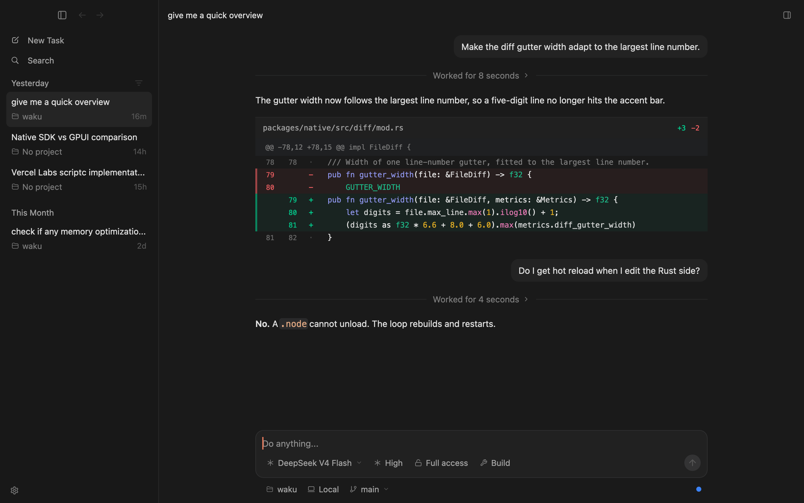
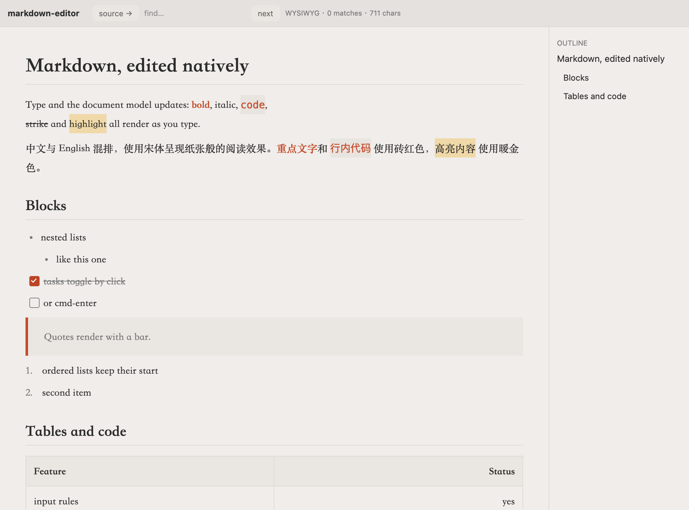
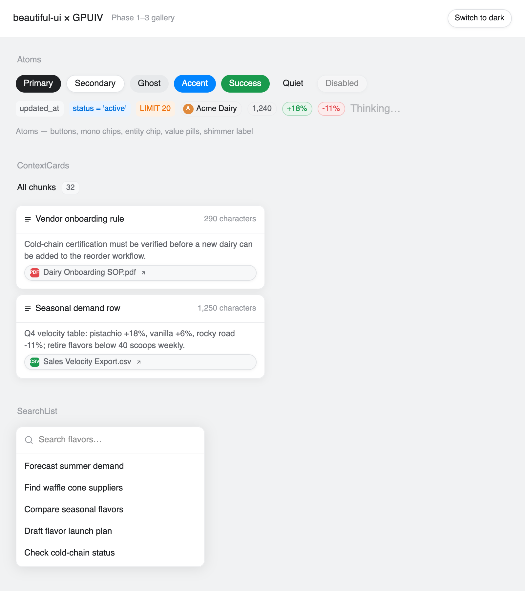
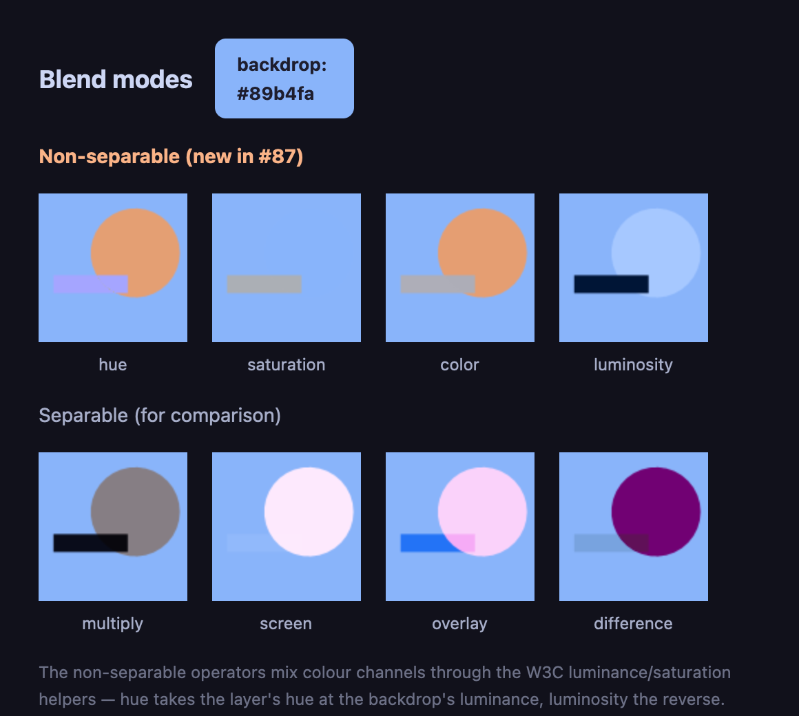

# GPUIV

**Build native desktop apps with Vue 3 and TypeScript.**

GPUIV renders your Vue components through [GPUI](https://github.com/zed-industries/zed/tree/main/crates/gpui),
the GPU UI framework behind Zed. Use Vue reactivity, TSX, and native desktop
APIs to build chat clients, editors, dashboards, and developer tools.
Rendering runs on Metal, DirectX, or Vulkan.

[](https://github.com/liuyanghejerry/gpuiv/actions/workflows/ci.yml)
[](https://www.npmjs.com/package/@gpuiv/vue)
[](LICENSE)

[Quick start](#quick-start) · [Examples](#examples) · [API reference](docs/reference.md) · [Build from source](docs/development.md)



*A working chat UI with virtualized messages, selectable Markdown, highlighted
diffs, and animated panels. [Explore the source](examples/chat.tsx) or
[run the demo](#run-the-examples). Replies use demo data.*

## What you can build

- **Content-rich tools:** native Markdown, syntax-highlighted code, virtualized
  diffs, ANSI logs, text selection, and a Markdown WYSIWYG editor.
- **Interactive interfaces:** inputs and IME support, keyboard navigation,
  headless Select / Combobox / Tooltip / Collapsible controls, and animations.
- **Desktop workflows:** multiple windows, file dialogs, clipboard access,
  menus, tray icons, global shortcuts, and file / deep-link delivery.
- **Custom visuals:** images, SVGs, and a Canvas 2D API with paths, gradients,
  compositing, and PNG export.
- **Testable apps:** drive native input with a Playwright-like automation API,
  inspect painted text, take screenshots, and capture exact animation frames.

Vue updates send only changed elements to Rust. GPUI handles layout and GPU
painting. Read [how the renderer works](docs/architecture.md) when you need
the details.

## Examples

These screenshots are captured from the actual examples with the native GPU
test renderer on macOS. Click an image to view it at full size.

<table>
  <tr>
    <th>Markdown editor</th>
    <th>Component gallery</th>
  </tr>
  <tr>
    <td width="50%"><a href="docs/images/readme-editor.png"></a></td>
    <td width="50%"><a href="docs/images/readme-gallery.png"></a></td>
  </tr>
  <tr>
    <td>Editable blocks, Markdown source mode, search, and outline navigation.<br /><a href="examples/markdown-editor.tsx">Source</a> · <code>bun --hot markdown-editor.tsx</code></td>
    <td>Light/dark themes and a gallery of native controls.<br /><a href="examples/beautiful-ui.tsx">Source</a> · <code>bun --hot beautiful-ui.tsx</code><br /><em>The Beautiful UI package is a private workspace demo.</em></td>
  </tr>
</table>

### Canvas compositing

<a href="docs/images/readme-canvas.png"></a>

Draw and composite through `getContext("2d")`. [Source](examples/canvas-blends.tsx). Run
`bun --hot canvas-blends.tsx`, or try the [paint app](examples/paint.tsx)
with brush strokes, shapes, and undo / redo.

### Run the examples

Clone and [build the repository](docs/development.md#building), then run from
`examples/`:

```bash
cd examples
bun --hot chat.tsx
```

| Start here | Run | What to try |
|---|---|---|
| [Counter](examples/counter.tsx) | `bun --hot counter.tsx` | Vue state, click events, and hover styles in a minimal app |
| [Chat](examples/chat.tsx) | `bun --hot chat.tsx` | Switch conversations, collapse the sidebar, open the model picker |
| [Markdown editor](examples/markdown-editor.tsx) | `bun --hot markdown-editor.tsx` | Edit formatted text, toggle a task, switch to source mode |
| [Component gallery](examples/beautiful-ui.tsx) | `bun --hot beautiful-ui.tsx` | Toggle light/dark, explore controls, tables, and a flowchart |
| [Native text](examples/native-text.tsx) | `bun --hot native-text.tsx` | Compare Markdown, code, and native diff rendering |
| [Paint](examples/paint.tsx) | `bun --hot paint.tsx` | Draw, erase, make shapes, undo / redo |
| [ANSI log](examples/ansi-log.tsx) | `bun --hot ansi-log.tsx` | Stream colored output into a selectable virtualized log |
| [Multiple windows](examples/window-resize.tsx) | `bun --hot window-resize.tsx` | Resize two independent native windows |

[Browse all examples](examples/), including [error boundaries](examples/error-handling.tsx),
[file opening](examples/open-files.tsx), [single-instance apps](examples/single-instance.tsx),
and [macOS window vibrancy](examples/blurred-window.tsx).

## Quick start

Install [Bun](https://bun.sh) and create a project. The npm packages include
prebuilt native binaries; you can start an app without compiling Rust.

```bash
mkdir my-gpuiv-app
cd my-gpuiv-app
bun init -y
bun add @gpuiv/vue vue
```

Set these compiler options in `tsconfig.json` so
[Bun's JSX transform](https://bun.sh/docs/runtime/jsx) uses Vue:

```json
{
  "compilerOptions": {
    "target": "ES2020",
    "module": "ESNext",
    "moduleResolution": "bundler",
    "jsx": "react-jsx",
    "jsxImportSource": "vue",
    "strict": true,
    "skipLibCheck": true
  }
}
```

Copy [`examples/shims.d.ts`](examples/shims.d.ts) into your project as
`gpuiv.d.ts` for editor and `tsc` checks. Vue's default JSX types describe
HTML/SVG; these declarations allow GPUIV's native props and slot children.

Create `app.tsx`:

```tsx
import { defineComponent, ref } from 'vue'
import { createApp } from '@gpuiv/vue'

const App = defineComponent({
  setup() {
    const count = ref(0)
    return () => (
      <div style={{
        display: 'flex', flexDirection: 'column', gap: 16,
        padding: 32, width: '100%', height: '100%',
        backgroundColor: '#18181b', color: '#fafafa',
      }}>
        <text style={{ fontSize: 24, fontWeight: 600 }}>Hello, GPUIV</text>
        <div
          onClick={() => count.value++}
          style={{
            padding: 16, borderRadius: 12, backgroundColor: '#2563eb',
            cursor: 'pointer', hover: { backgroundColor: '#1d4ed8' },
          }}
        >
        <text>{`Count: ${count.value}`}</text>
        </div>
      </div>
    )
  },
})

createApp(App, { title: 'My first GPUIV app', width: 640, height: 400 })
```

Run it:

```bash
bun --hot app.tsx
```

Click to update the counter. Save the file to remount the app in the same
native window. For component-level Fast Refresh that preserves other
components' state, add the [HMR preload](docs/reference.md#hot-reload).

GPUIV uses native elements and a supported subset of CSS-style properties.
Start with `<div>` for layout and `<text>` for content; consult the
[elements](docs/reference.md#supported-elements),
[styles](docs/reference.md#supported-styles), and
[events](docs/reference.md#supported-events) when adapting a browser UI.

## Status

GPUIV is an experimental, self-maintained Vue 3 fork. It is suitable for
exploring native desktop UIs; check platform-specific APIs and the
[full feature checklist](docs/status.md) before choosing it for your app.

| Platform | Renderer | Prebuilt binaries | GPU tests / screenshots |
|---|---|---|---|
| macOS | Metal | Apple Silicon and Intel | Available |
| Windows | DirectX | ARM64 and x64 | Available |
| Linux | Vulkan | ARM64 and x64 (GNU) | Not yet |

Menus and vibrancy are macOS-specific. Nested scrolling is currently
unsupported. App packaging is a workspace tool for macOS `.app` bundles and
Windows portable executables; signing, notarization, and Linux packaging are
still pending. See [packaging](docs/reference.md#packaging) and
[remaining engineering work](AGENTS.md#todo).

## Documentation

| I want to… | Go to |
|---|---|
| Look up a component, style, or event | [API reference](docs/reference.md) |
| Automate and test my app | [Automation](docs/reference.md#automation) · [GPU-backed tests](docs/reference.md#testing) |
| Debug updates or enable Fast Refresh | [Runtime errors](docs/reference.md#runtime-errors) · [Hot reload](docs/reference.md#hot-reload) · [Vue DevTools](docs/reference.md#vue-devtools) |
| Package a desktop app | [Packaging guide](docs/reference.md#packaging) |
| Understand Vue → Rust → GPUI | [Renderer architecture](docs/architecture.md) |
| Build or contribute to GPUIV | [Development guide](docs/development.md) · [Contributor rules](AGENTS.md) |
| Check support and known gaps | [Feature status](docs/status.md) · [Upstream tracking](docs/upstream/README.md) |

## Relationship to upstream GPUIX

GPUIV is a personal fork of [remorses/gpuix](https://github.com/remorses/gpuix),
created for experimentation and learning. Upstream GPUIX provides Node.js and
React bindings for GPUI; this fork replaces the React-facing package with a
Vue 3 custom renderer, published as `@gpuiv/vue` and `@gpuiv/native`.

The Rust/napi-rs layer, retained tree, mutation protocol, native elements, and
testing approach originate in GPUIX. The fork's synced changes and deliberate
differences are recorded in [the upstream ledger](docs/upstream/README.md).
Ported code from Comet and other projects is credited in
[third-party notices](THIRD_PARTY_NOTICES.md).

## License

[Apache-2.0](LICENSE)
